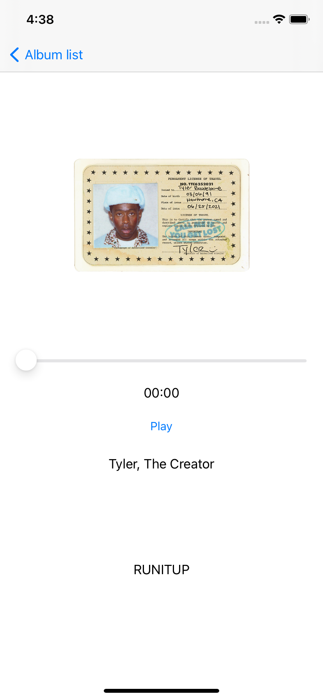
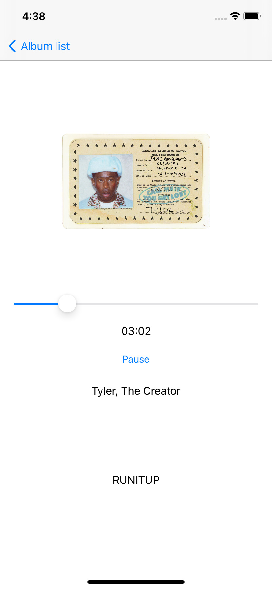
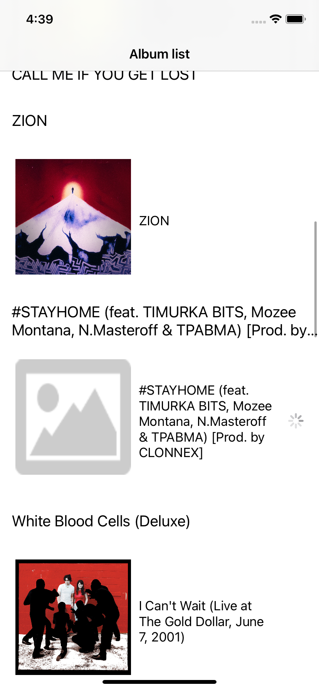
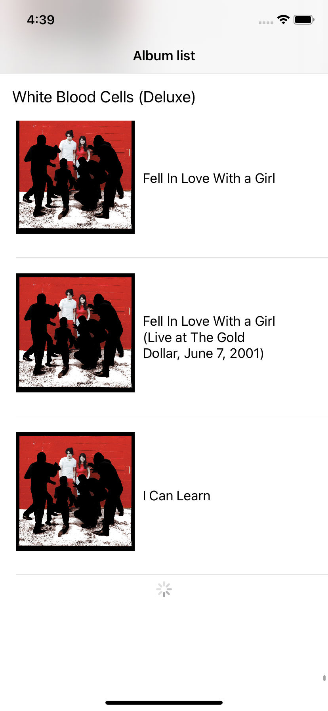

# MobiMusic

Для фонового воспроизведения нужно добавить Capability -> Background Modes -> Audio, AirPlay, and Picture in Picture.
И добавить код в AppDelegate:
func application(_ application: UIApplication, didFinishLaunchingWithOptions launchOptions: [UIApplication.LaunchOptionsKey: Any]?) -> Bool {
    do {
        try AVAudioSession.sharedInstance().setCategory(.playback, mode: .default, options: [.mixWithOthers, .allowAirPlay])
        print("Playback OK")
        try AVAudioSession.sharedInstance().setActive(true)
        print("Session is Active")
    } catch {
        print(error)
    }
    return true
  }

